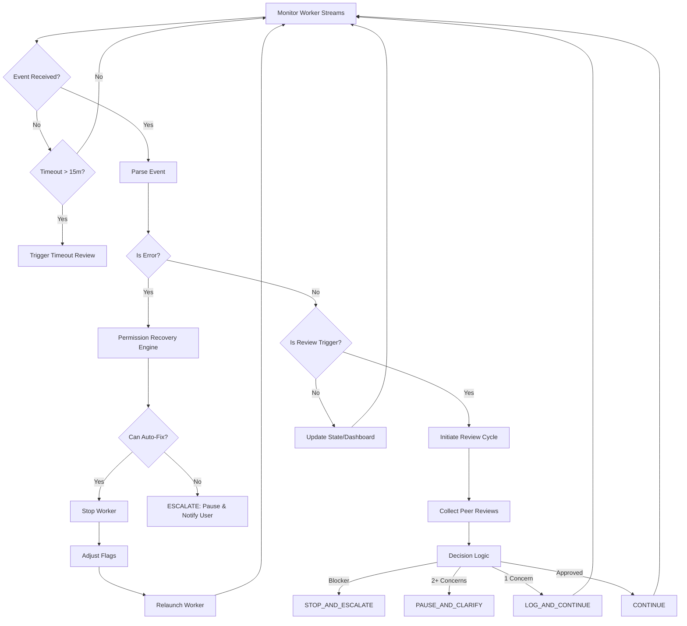

# Complete Flow Diagram

## System Lifecycle

The orchestration process follows a linear flow with cyclic monitoring and recovery branches.

### 1. Initialization Phase
1.  **User Command**: `/orchestrate "task"`
2.  **Task Analysis**: Orchestrator decomposes task -> `[Gemini Task, Claude Task, Codex Task]`
3.  **Permissions Setup (Proactive)**:
    - Validate/Create `workspace_dir`
    - Validate `target_dir`
    - `chmod 755` if needed
4.  **Dashboard Launch**: Start API server & UI.

### 2. Execution Phase (The Loop)

**Launch Workers** (with Fallback Strategy)

**Main Loop:**

### 3. Completion Phase
- **Trigger**: All agents report `MILESTONE: COMPLETE`
- **Final Review**: Full consistency check.
- **Success**: `DEFINITION_OF_DONE` met.
- **Artifacts**: Source code, tests, documentation finalized in `target_dir`.
